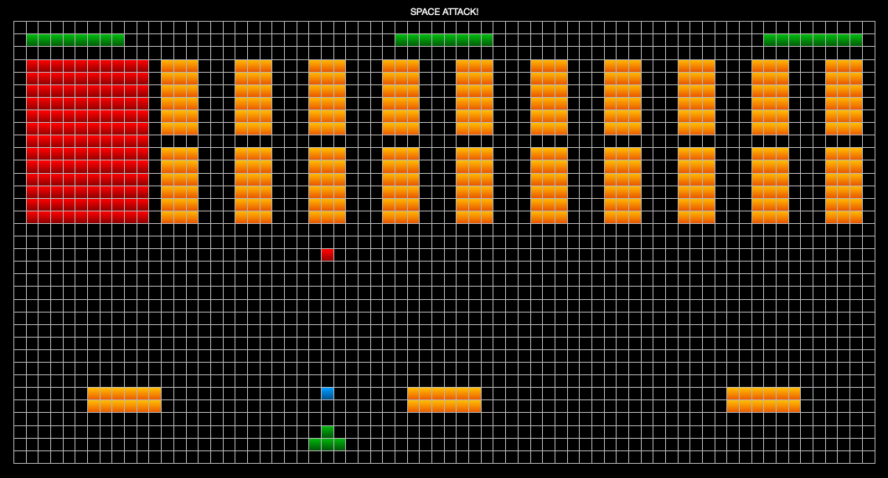

# SPACE ATTACK!

##### This is a web based arcade game like SPACE INVADERS.
*In my version of the game you'll have 4 main levels. In the first level you'll have one line of aliens to fight and each of them has 1 life each, in the second level you'll have 1 line more of aliens and the new ones will have 2 lives each and so on until the level 4. Every level at the end has a monster to fight and it will have half of the total lives of the aliens that you defeated in that level. Those 4 levels will repeat 3 times with an increased speed, in order to be more challenging and to have at the end 12 levels & 12 monsters to fight.*

#### Stack technologies used:
  - Javascript
  - html
  - css  

#### Diagram of the game space by px  
- Space component 1400x700px
- 20px border
- 20x20px each square

#### Elements of the game

| components    | num. components | px dimension | lives |
|---------------|-----------------|--------------|-------|
|Shuttle        |1                |60x40         |6      |
|Shields        |3                |120x40        |3 each |
|Shuttle Laser  |1                |6x6           |-      |
|Aliens Laser   |1                |6x6           |-      |
|1st Aliens row |10               |40x40         |1 each |
|2nd Aliens row |10               |40x40         |2 each |
|3rd Aliens row |10               |40x40         |3 each |
|4th Aliens row |10               |40x40         |4 each |
|1st Monster    |1                |120x120       |5      |
|2nd Monster    |1                |120x120       |15     |
|3rd Monster    |1                |120x120       |30     |
|4th Monster    |1                |120x120       |50     |
|Shuttle lives  |1                |-             |-      |
|Life drop      |1                |-             |-      |

#### Levels

| Level       | Description                             |
|-------------|-----------------------------------------|
| 1           | 1st row of aliens + 1st monster         |
| 2           | 2nd & 1st rows of aliens + 2nd monster  |
| 3           | 3rd to 1st rows of aliens + 3rd monster |
| 4           | 4th to 1st rows of aliens + 4th monster |
| 5, 6, 7, 8, 9, 10, 11 & 12 | Repeat from level 1 to level 4 two times, with increased speed and aliens-monster lives. |
